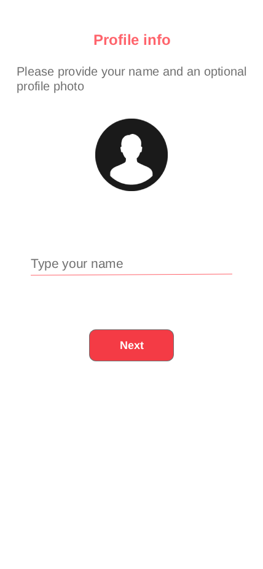

# 📱 Helpy - Emergency Alert App

**Helpy** is a mobile application that sends an **instant SOS notification** to your pre-added emergency contacts when you need help — such as when you're **lost, in danger, feeling unsafe, or experiencing a medical emergency** — all with just **one tap**.

It uses the **Google Geolocation API** to include your **live location coordinates** in the alert, helping your contacts find and assist you quickly.

---

## 🚀 Features

- 📍 **One-Tap Emergency Alert**
- 📡 **Real-Time Location Sharing** via Google Geolocation API
- 🔔 **Firebase Push Notifications**
- 🔐 **Contact-Based Alert System** – Notifies pre-saved numbers
- ⚛️ Built with **React Native**
- 📦 State Management via **Redux**
- 🌐 API requests handled using **Axios**
- 🧭 **Geolocation API** integration
- 🔧 Backend powered by **Node.js** and **Express.js**

---

## 🖼️ Screenshots

Below are screenshots showcasing different screens of the **Helpy** app:

| Splash Screen | Login | Otp Verification |
|-------------|--------------|---------------|
|  |  |  |

| Profile | Home | Edit Message | Drawer Nav |
|---------------|--------------|----------|--------------|
|  |  |  |  |

---

## 🛠️ Tech Stack

- **Frontend**: React Native
- **State Management**: Redux
- **HTTP Client**: Axios
- **Location Services**: Google Geolocation API
- **Notifications**: Firebase Cloud Messaging (FCM)
- **Backend APIs**: Node.js + Express.js

